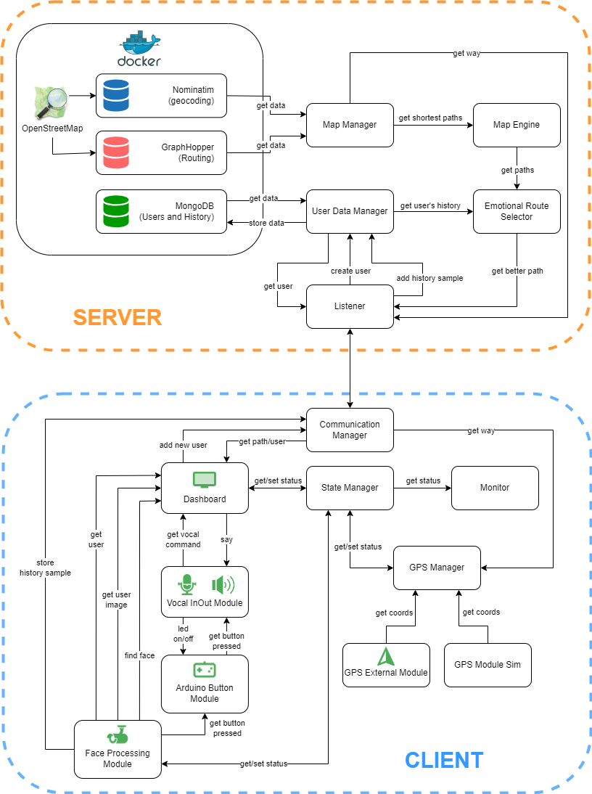
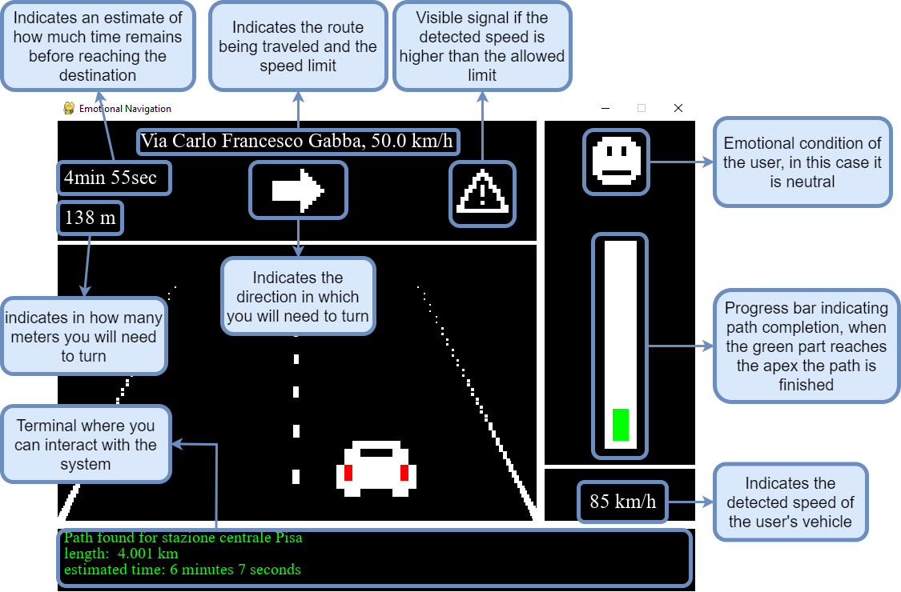
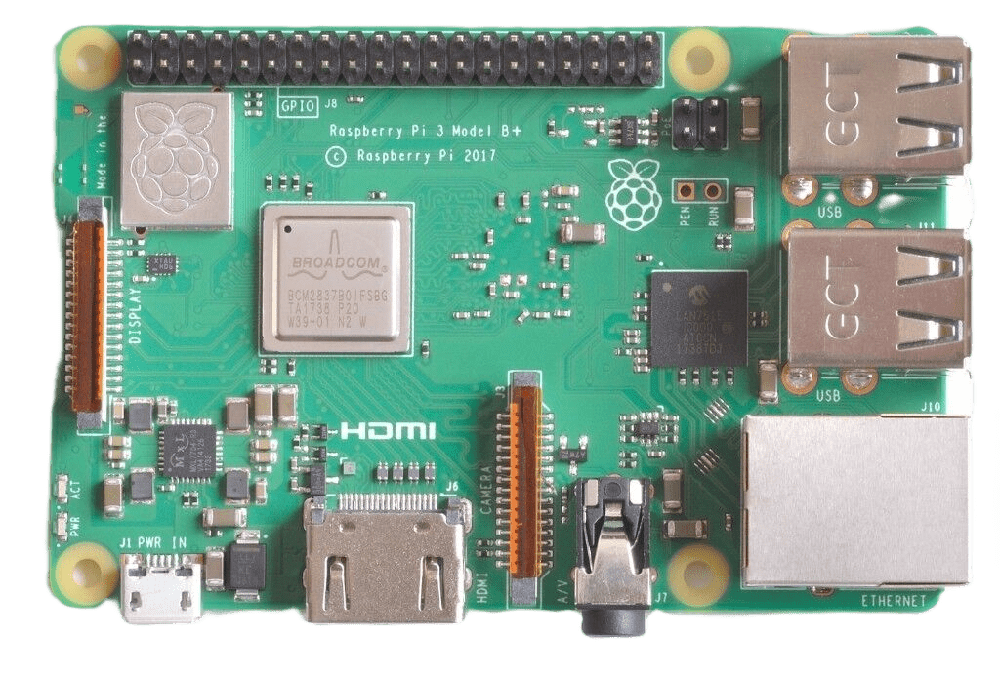
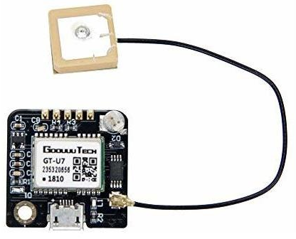
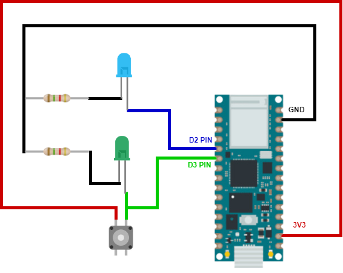
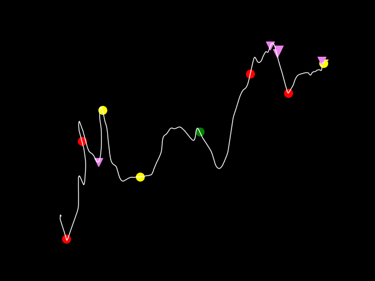
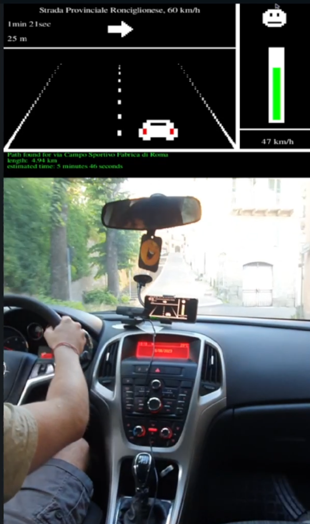

<p align="center">
  
</p>


# Emotional Navigation

University Project for "Industral Applications" course (MSc Computer Engineering @ University of Pisa).
## Overview

This project aims to propose an innovation in the field of in-car driving assistants such
as Google Map or Waze. The idea is to introduce human emotions as input into path
generation, in fact a path from a starting point to an end point would be evaluated not
only by traditional characteristics such as shortness in km and estimated travel time, but
also by the emotions that path might arouse in the user. To do this, an emotional historian
was designed to collect for each user the emotions felt while driving, these emotions are
then used to construct an emotional path score, that is, a measure of how much the path
might be enjoyed.

The requirements and functionalities of the application are as follows.

 * Must be able to **geolocate** the user on the road and **provide directions** if a destination has been set
 * The route is **automatically recalculated** whenever the user deviates from the route that was established
 * The client module is activated after detecting a face through a **face detection** service
 * the client module recognizes users through a **face recognition** service, if the user is unknown a new user profile is created
 * Each user has a **profile** consisting of username, face image for authentication, and an emotional history
 * The system periodically detects the user's emotions and associates them with the stretch of road being traveled, these tuples (emotion, road, timestamp) will compose the user's **emotional history**
 * Whenever a path has to be constructed from the current location to a destination, that path has to be **evaluated through the emotional history**, if the route is evaluated negatively (because it is composed of roads not liked by the user) a better rated path is chosen that does not bring too much delay
 * The client module must **interact** with the user **vocally**
 * The system initiates **speech recognition** if the user presses a specially designed button


## Related Works
The following open-source projects were used to build the prototype:
* **Deepface**: It is a project written in python that encapsulates state-of-the-art models for face detection and face recognition, also includes an emotion recognition
model.
https://github.com/serengil/deepface
* **OpenStretMap**: It is a project that proposes to be an open source alternative to
digital maps, it has a large community behind it that keeps it updated with data of
streets, monuments, stores and more.
https://www.openstreetmap.org/about
* **Graphhopper**: It is a routing engine with REST API that can calculate paths
based on OpenStreetMap data efficiently.
https://github.com/graphhopper/graphhopper
* **Nominatim**: It is a tool that can provide, via REST API, geocoding and reverse
geocoding services by exploiting OpneStreetMap data.
https://github.com/osm-search/Nominatim
* **Edge-TTS**: Python module that allows you to exploit Microsoft Edge’s online Textto-Speech service.
https://github.com/rany2/edge-tts
* **SpeechRecognition**: Python module that encapsulates various Speech-to-Text
services such as CMU Sphinx, Whisper and Google.
https://github.com/Uberi/speech_recognition#readme
* **PyGame**: Python module for game building, in this prototype it was used for
creating the user dashboard
https://github.com/pygame/pygame


## Architecture Overview

<p align="center">
  
</p>

## The GUI

<p align="center">
  
</p>

## Prototype Description

### Dell Latitude 5480 (Server)
* OS: Windows 10
* CPU: Intel Core i5-6200U (2 cores, 4 threads) 2.80 GHz
* RAM: 16GB DDR4
* GPU: Intel HD Graphics 520

<p align="center">
  
</p>

### Raspberry Pi 3 Model B+ (Client)
* OS: Raspberry Pi OS
* CPU: quad-core ARM Cortex-A53 64-bit 1.4GHz
* RAM: 1GB LPDDR2
* GPU: VideoCore IV

<p align="center">
  
</p>

### Devices Connceted to Client

*  WEMISS CM-A1 Camera
<p align="center">
  
</p>

*  SONY SRS-XB13 Speaker
<p align="center">
  
</p>

* GT-U7 GPS Module
<p align="center">
  
</p>

### The Control Device
This device was used to physically interact with the system and was made from the
following components:
* Arduino Nano RP2040 microcontroller
* button
* blue led, green led
* 2 resistors (220 Ohm)

The operation of this device is very simple, the blue led is turned on if the microcontroller
receives via serial the string ’ON’, and it is turned off if the microcontroller receives
’OFF’. Pressing the button the green led is turned on and the microcontroller sends via
serial the string ’PRESSED’. This system is used by the client to turn on the blue led
if the microphone is listening, while if it receives the button signal it starts the speech
recognition procedure (the same result can be obtained by using the RIGHT SHIFT key
on the keyboard).

<p align="center">
  
</p>

## Prototype Road Test Result

It is the road path followed during the test.
The indicators on the path have the following meanings:
* red circle: collected negative emotion
* yellow circle: collected neutral emotion
* green circle: collected positive emotion
* violet inverted triangle: path recalculation due to an error in positioning the gps coordinates in the path or an error in the driver's turn

<p align="center">
  
</p>

A schreenshot during the test
<p align="center">
  
</p>

## Getting Started

Install all libraries

```bash
pip install -r requirements.txt
```

Initialize the server

```bash
cd build
make
python3 initialization.py
```

Run the Server

```bash
python3 -m Server.server
```

Run the Client

```bash
python3 -m Cleint.client
```

### Note: 
* modify the config.json file in Client/Resource to prepare your client
* install ffmpeg
* install flac on Linux
* use 'pip install -r requirements.txt --no-cache-dir' if the process crash during the installation

## Project Architecture

```
Emotional Navigation
├── arduino_module.ino
├── build
├── requirements.txt
├── Client
│   ├── Dashboard
│   ├── InOutModules
│   ├── Monitor
│   ├── Resources
│   ├── client.py
│   ├── communication_manager.py
│   └── state_manager.py
└── Server
    ├── Core
    ├── Persistence
    ├── listener.py
    └── server.py

```

## Author

Gianluca Gemini (gianlucagemini98@gmail.com)


